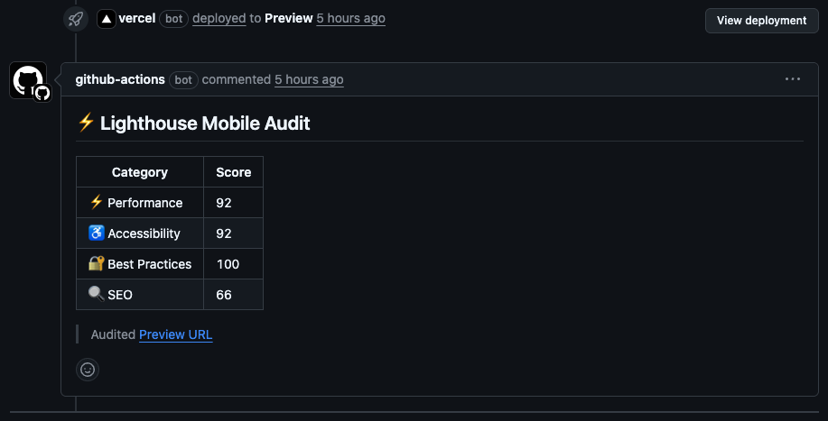

# 🔦 Lighthouse PR Commenter for Vercel

Automatically runs a Lighthouse audit against your Vercel preview deployment and posts the results as a comment on the related pull request.

> Perfect for performance monitoring on every PR — no 3rd-party integrations needed.

---

### 🚀 Why use this?

* 📊 Automated Lighthouse audits without any manual setup
* 🔍 Uses the deployed Vercel **preview URL**, not localhost
* 🔹 Comments the results right on the PR and updates on every commit
* 👷 Acts as your performance gate before merging

---

### 🚀 Features

* 📊 Audits **Performance**, **Accessibility**, **Best Practices**, and **SEO**
* 🧪 Uses **Lighthouse mobile config** with throttling **disabled**
* 🤦 Posts a PR comment and **updates it on each push**
* 🔍 Auto-detects Vercel preview deployments using GitHub Deployments API
* ⚙️ Easy to configure, extend, and customize

---

### 📆 Example Output (Live Screenshot)



---

### 📦 Usage

Add this workflow to `.github/workflows/lighthouse.yml`:

```yaml
name: Lighthouse Audit on PR

on:
  pull_request:
    types: [opened, synchronize]

jobs:
  lighthouse:
    name: Run Lighthouse on Vercel Preview
    runs-on: ubuntu-latest

    steps:
      - name: Checkout code
        uses: actions/checkout@v4

      - name: Run Lighthouse and comment on PR
        uses: robbiecren07/lighthouse-vercel-action@v1.1.0
        with:
          github_token: ${{ secrets.GITHUB_TOKEN }}
          max_timeout: '120' # optional - defaults to 180 seconds
          check_interval: '20' # optional - defaults to 10 seconds
```

> **⚠️ Tip:** If the Vercel deployment isn't ready in time, increase `max_timeout`.

---

### 🛠️ Inputs

| Name             | Required | Description                                                            |
| ---------------- | -------- | ---------------------------------------------------------------------- |
| `github_token`   | ✅        | GitHub token to authenticate and post/update PR comment                |
| `max_timeout`    | ❌        | Max time (in seconds) to wait for Vercel deployment (default: `180`)   |
| `check_interval` | ❌        | Interval (in seconds) between deployment status checks (default: `10`) |

---

### 🥺 Want More?

* Fail PRs based on Lighthouse thresholds? Coming soon.
* Export Lighthouse reports as JSON or upload as GitHub artifacts? Planned.
* Have suggestions or want to contribute? [Open an issue](https://github.com/robbiecren07/lighthouse-vercel-action/issues)!

---
